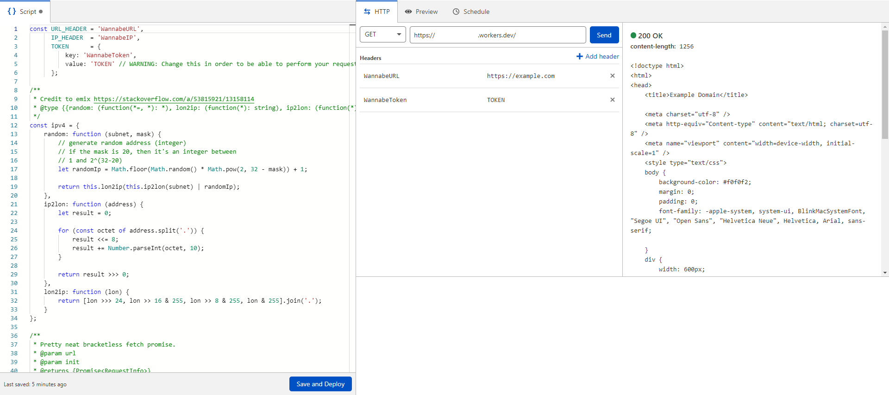

# CFWorkersProxy
 Proxy cloudflare workers request in order to bypass some WAF

 ### How to use?
 First of all create new worker and paste the script index.js into your worker.
 Save the changes and make your request.
 